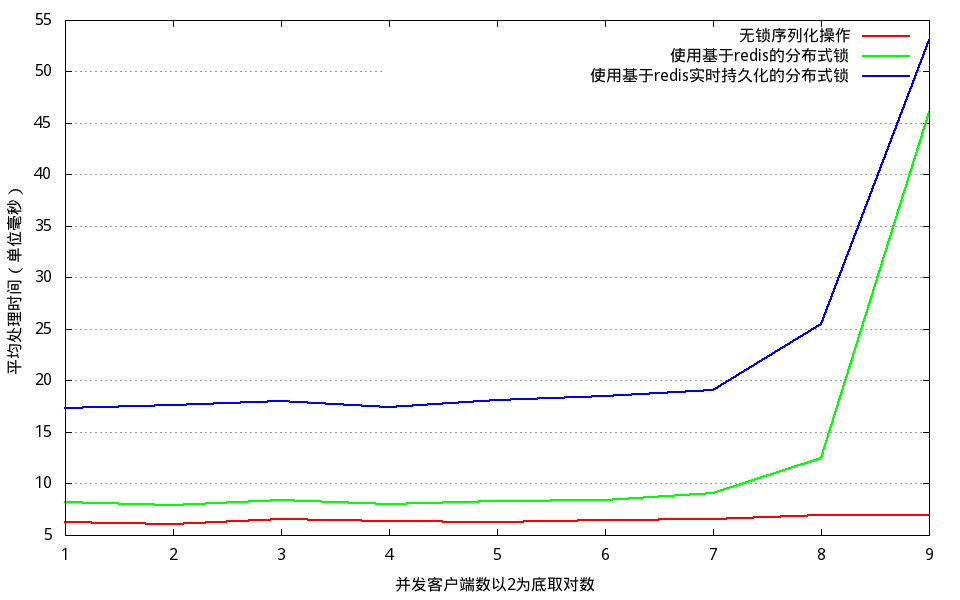
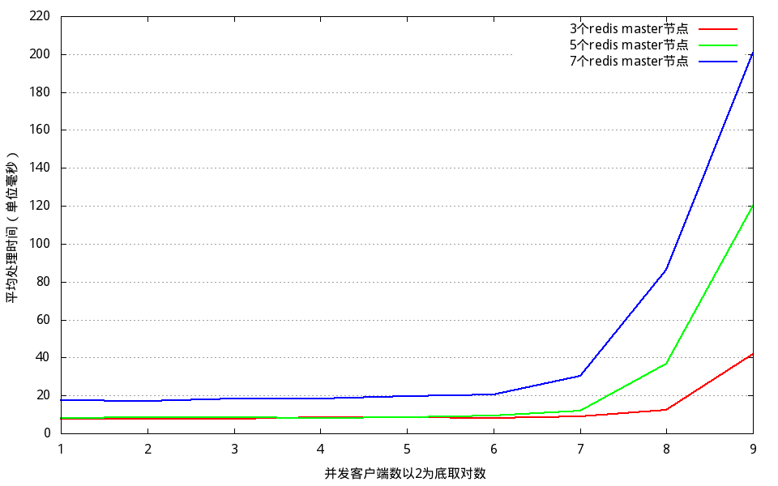

## Performance test between distributed lock using redis and nolock

redis can be set with aof and fsync=always support and no aof

### Dependency

* [go](https://golang.org/)
* [python](https://www.python.org/)
* [etcd](https://github.com/coreos/etcd), install to /usr/local/bin/etcd or modify ctrl_redis_etcd.sh
* [redis](http://redis.io), install to /usr/local/bin/redis-server or modify ctrl_redis_etcd.sh
* [gnuplot](http://www.gnuplot.info/)
* [chinese font wqy](http://wenq.org/wqy2/index.cgi), e.g. on ubuntu: sudo apt-get install ttf-wqy-microhei

### Build & Run benchmark

    make
    ./ctrl_redis_etcd.sh start
    python bench.py

### Sample benchmark results

Run etcd, redis master on a same machine with
* 4-core cpu Intel Xeon E5-2630 0 @ 2.30GHz, 8GB memory.
* host os Ubuntu 14.04.2 LTS X86_64 with Linux kernel 3.13.0-32-generic.

Benchmark comparison when changing concurrent clients from 2^0 to 2^9

Benchmark using distributed lock with different number of redis master

